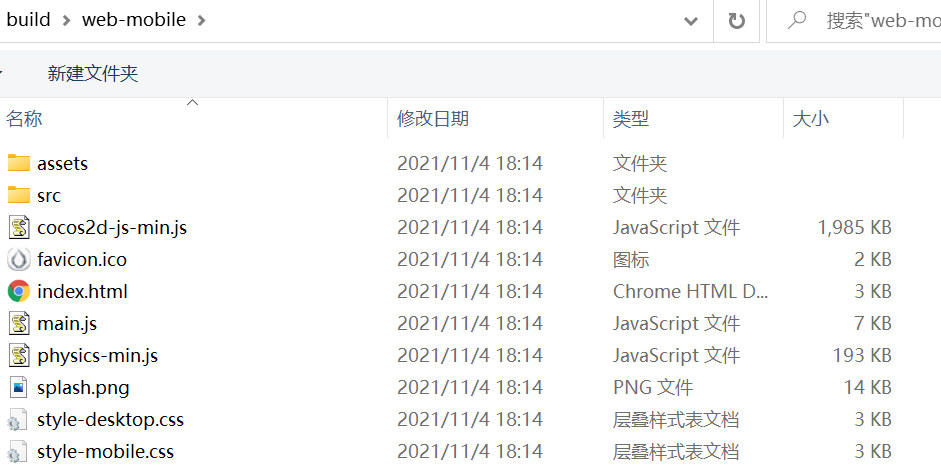
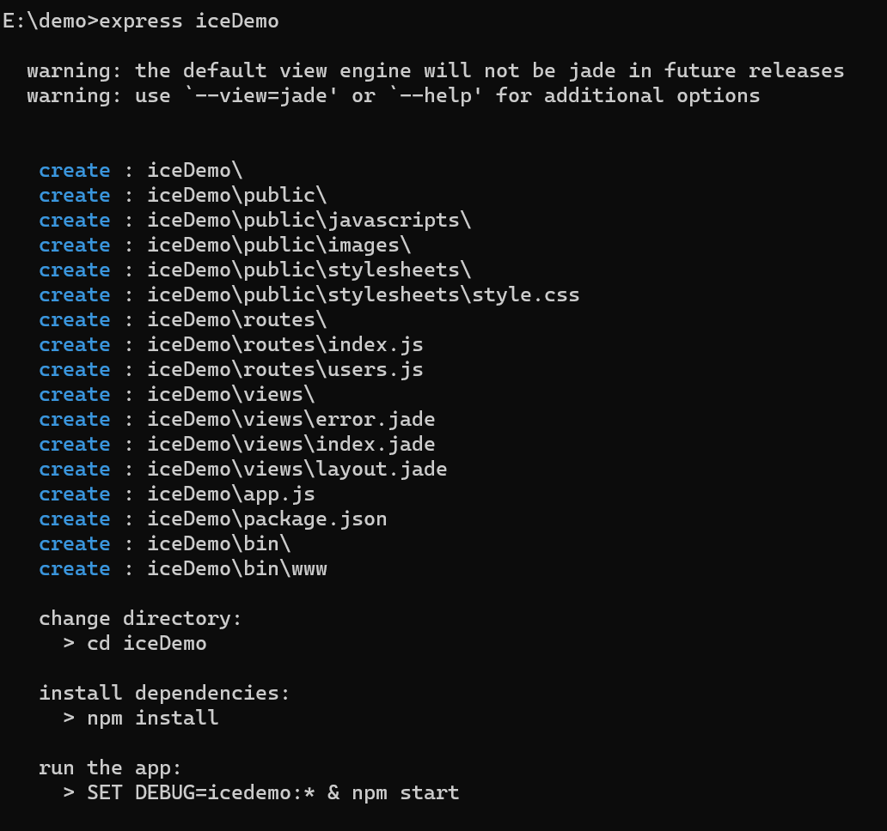
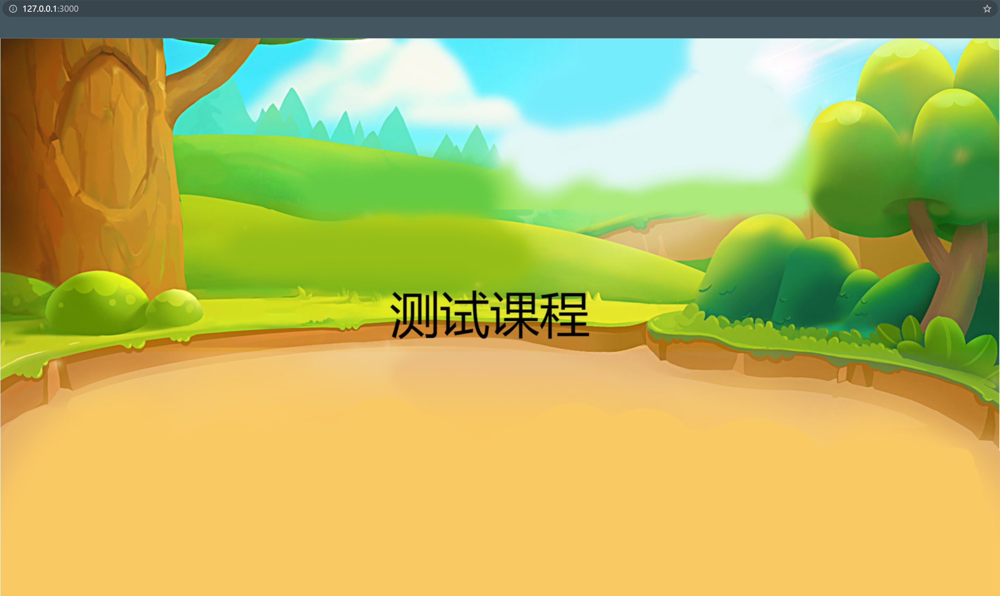

# 项目部署

Cocos ICE 课件创作完成后需要简单部署才能放在外网供他人使用。

## 课件发布

第一步，点击编辑器右上角 **发布** 按钮进行项目发布。

 

课程发布格式默认为 **HTML** 格式，发布成功后文件结构如下：



## 服务器部署

课件发布后的项目不能直接通过打开 `index.html` 预览，需要部署到相应的环境访问 URL 预览。

### 下载与安装

下载最新 **Node.js** 安装包，推荐 [**官网**](https://nodejs.org/zh-cn/) 下载。

安装完成之后检测是否安装成功，控制台输入 `node -v`，出现如下图即为安装成功:


更多安装细节请参考 [**菜鸟教程**](https://www.runoob.com/nodejs/nodejs-install-setup.html)。

### 环境搭建

安装完 **Node.js** 之后，还需要安装相应的环境依赖，推荐使用 **Express 框架**，命令行环境执行下面的命令来安装：

```js
$ npm install express --save
$ npm install express-generator -g
```

安装完成后，在命令行环境下执行 `express -V`，可以看到 Express 的版本是 4.16.1。


现在我们使用 Express 命令来创建一个默认的网站，在命令行环境下执行下面的命令：

```js
$ express iceDemo
```

可以看到控制台输出 **iceDemo** 工程目录：



> Express 默认生成的是 Jade 模板工程，如果想要使用 EJS 模板，请在命令后面加上 `--ejs`。

运行课件包我们只需要将打包好的课件 **web-mobile** 文件夹复制到 public 文件夹中，启动项目即可。

### 项目启动

安装所有依赖包（只需要执行一次）：

```js
$ cd iceDemo
$ npm install
```

在 MacOS 或 Linux 中，通过如下命令启动此应用：

```js
$ DEBUG=myapp:* npm start
```

在 Windows 命令行中，通过如下命令启动:

```js
> set DEBUG=myapp:* & npm start
```

然后在浏览器中打开 `http://localhost:3000/` 网址或您的外网网址就可以看到这个应用了。

