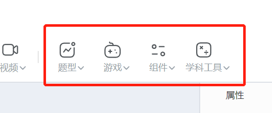
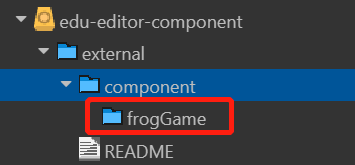

# Cocos Creator 项目迁移

Cocos ICE 基于 Cocos Creator 扩展而来，二者项目结构相似，因此用 Cocos Creator 开发的游戏在经过简单适配后可以迁移进 Cocos ICE 中作为独立组件使用。
## 项目目录介绍

编辑器有两种组件库模式：**云端组件** 与 **本地组件**，**云端组件** 目录在系统目录下由编辑器动态生成，**本地组件** 目录在应用内，因为编辑器默认为 **云端组件** 模式，所以 **本地组件** 目录是空的，Mac 和 Windows 平台的目录有些许差异，具体如下：

- Windows平台
截至 v1.4 版本，**Cocos ICE** 在 **Windows** 平台依然是绿色版软件（解压即用）
  - 云端组件目录：`C:\Users\用户名\.EduEditor\ICE_Project\assets\eduComponent`
  - 本地组件目录：`.\resources\builtin\edu-editor\ui-component\external`

- Mac平台

  - 云端组件目录：`./Users/用户名/.EduEditor/ICE_Project/assets/eduComponent`
  - 本地组件目录：`./Contents/Resources/builtin/edu-editor/ui-component/external`
    - Mac **本地组件** 打开方式：应用程序中找到 **Cocos ICE** 应用程序，右键单击 **显示包内容**。
  
      


## 组件基础

这一小节将介绍组件库的一些基础知识与注意事项，方便您快速了解组件库。

### 组件模式

组件模式切换只需要找到配置脚本 `.\edu-editor\source\edu\settings\default.ts`，修改 `depend-local-resource` 属性，设置为 `true` 则扫描本地资源，反之请求服务器资源。

```js
    // 设置 settings 的一些默认值
    export const editor = {
    // 是否依赖本地资源，设置为 true 则扫描本地资源，反之请求服务器资源
    'depend-local-resource': true,
    // 是否开启批量上传的功能
    'batch-upload-assets': false,
    // 启用默认分辨率预览
    'default-resolution-preview': true,
    // 创建的页面的分辨率设置
    'design-resolution': {
        width: 1920,
        height: 1080,
    },
    // 素材库服务端相关设置
    'assets-server': {
        host: 'dev-edu.cocos.org',
        port: '8080',
        protocol: 'http',
    },
    ...
``` 
### 组件分类

编辑器靠 `desc.json` 文件识别组件，配置代码如下：
```js
/**
 * 组件定义的格式
 */
export interface ICustomComponent {
    componentID: string; // 组件 id
    name: string; // 组件名称
    version: string; // 组件版本
    prefab: string; // prefab 的 db 的路径或者相对路径
    icon: string; // 显示的图片路径
    type: ComponentsType; // 类型
    typeOrder?: number; // type 的排序，数字越大放越后面
    tab: TabType | string; // 页签（分组）
    tabOrder?: number; // tab 的排序，数字越大，放越后面
    group?: string; // 子分组
    groupOrder?: number; // group 的排序，数字越大，放越后面
    tag?: string[]; // 这个组件的标签
    description?: string; // 对这个组件的描述
    author?: string; // 作者
    sort: number; // 自身排序，数字越大，放越后面
    dependModules?: { [key: string]: string }; // 组件依赖
    [key: string]: any; // 其他自定义格式
}
```

组件分类使用 `type` 属性控制一级类别，如图所示：



组件分类使用 `group` 属性控制二级类别，如图所示：


### 注意事项
- 暂不支持本地组件和云端组件共存，开启本地组件模式时，编辑器依然会扫描云端组件目录，当同一组件同时出现在云端组件目录和本地组件目录中时，二者会互相干扰，导致组件运行异常。
- `desc.json` 必须存在且存在于组件根目录，组件识别、组件上传都依赖 `desc.json`， `prefab` 属性用于记录组件初始入口，不能为空。
- 编辑器自带 `主场景(Main Scene)` ，所以不支持组件使用 `Scene`，也不支持场景加载和切换。
  - 由于组件不支持使用 `Scene`，所以组件需要以 `Prefab` 的形式存在，组件添加到场景中时也是以 `Prefab` 的形式存在的。
- 编辑器自带 `主摄像机(Main Camera)`，如若组件内自带其他 `Camera` ，大概率会与主摄像机产生冲突导致画面显示异常，请自行做好调试。

- 组件脱离 `asset` 存在，目录中理论上也无法存在 `resources` 文件夹，所以无法直接使用 `cc.assetManage` 和 `cc.resource` 加载组件内资源，如果有需要，可以将相关文件夹配置为 `Bundle`，使用编辑器内置的 `Bundle` 加载方法加载资源，操作如下：
  - 配置 Bundle，为避免打包之后 `Bundle` 加载异常，组件内的 **Bundle 优先级** 统一设置为 **3**。

    

  - 修改 Bundle 加载逻辑，代码示例：
  - 
    ```js
    import {BundleLoader} from "GameConfig";
    @ccclass
    export default class BundleDemo{
    /**
        * 加载资源
        * @param url   资源路径
        * @param type  资源类型
        * @param cb    回调
        * @method loadRes
        */
        public static loadRes (url: string, type: any, cb: Function) {
            new BundleLoader(BundleName, (bundle) => {
                bundle.load(url, type, (err: { message: any; }, res: any) => {
                    if (err) {
                        cc.error(err.message || err);
                        cb(err, res);
                        return;
                    }
                    cb(err, res);
                });
            });
        }
    }
    ```

## 属性面板配置

如下图所示，组件一般都带有各种各样的配置性选项，如果想要一个属性在属性面板中显示，需要使用 `@eduProperty` 定义属性，详细请查看  [**自定义属性**](../develop-component/develop-properties/index.md)。


## 迁移示例

接下来将用一个 **青蛙游戏** 的例子来简单演示一下迁移过程。

 

> **注意**：请确保您开启了本地组件模式，参考[组件模式](#组件模式)。

### 代码搬运

进入 Cocos ICE **研发模式** ，在本地组件目录新建 `froGame` 文件夹；



将 Cocos Creator 项目中 `asset` 目录下的全部文件拷贝至 `froGame` 文件夹中；

### Bundle 调整

将原有 `resources` 改名为 `res`，并更改 `Bundle` 配置：


更改 `frog`  Bundle 配置：


### 场景调整

将游戏场景文件 `frog.scene` 转为 `frog.prefab` 文件：

 

### 脚本调整

调整完场景配置，接下来对脚本代码进行调整以便在运行时以及打包后运行正常。

#### 继承 EduElementAbstract

组件如果需要在属性面板展示自定义属性，必须继承 `EduElementAbstract`，例如：

```js
export default class FrogAnswerElement extends EduElementAbstract{}
```

#### 增加 EduElement 组件

属性面板默认是空的，没有任何属性配置，如图：


如过需要展示相关属性配置，需要手动在组件节点上挂载 `EduElement` 组件，添加方式如下图操作：

 

其中 `EduElement` 目前主要包括 角度、大小、层级、位置、节点树 五个配置项。

- 层级调整无法穿透节点、组件，例如；当B组件层级比 A 组件层级高时，A 组件中的子节点永远无法通过调整层级的方式浮于 B 组件之上。
- 节点树会显示当前画布上的所有组件，包括子组件，详细参考 [**节点树**](../develop-component/node-setting/index.md)。


#### Bundle 加载逻辑调整

将项目内所有使用 `cc.assetManage` 和 `cc.resource` 加载 `Bundle` 资源的代码全部改为 `BundleLoader` 加载，详细原因请参考 [注意事项](#注意事项)，参考下面示例：

- 修改前的代码：
  ```js
    @ccclass
    export default class FrogUtil {
    /**
        * 加载资源
        * @param url   资源路径
        * @param type  资源类型
        * @param cb    回调
        * @method loadRes
        */
        public static loadRes (url: string, type: any, cb: Function) {
            cc.assetManager.loadBundle('frog', (err: Error, bundle: cc.AssetManager.Bundle) => {
                if (err) {
                    cc.error(err.message || err);
                    cb(err, bundle);
                    return;
                }
                bundle.load(url, type, (err: { message: any; }, res: any) => {
                    if (err) {
                        cc.error(err.message || err);
                        cb(err, res);
                        return;
                    }
                    cb(err, res);
                });
            });
        }
    }

  ```
- 修改后的代码：
  ```js
    import { BundleLoader } from "GameConfig";
    @ccclass
    export default class FrogUtil {
    /**
        * 加载资源
        * @param url   资源路径
        * @param type  资源类型
        * @param cb    回调
        * @method loadRes
        */
        public static loadRes (url: string, type: any, cb: Function) {
            new BundleLoader('frog', (bundle) => {
                if (bundle) {
                    bundle.load(url, type, (err: { message: any; }, res: any) => {
                        if (err) {
                            cc.error(err.message || err);
                            cb(err, res);
                            return;
                        }
                        cb(err, res);
                    });
                }
            });
        }
    }
  ```

#### 增加属性面板自定义配置

下面是标题背景的属性面板配置示例，详细请查看 [**自定义属性**](../develop-component/develop-properties/index.md)。

```js
import FrogConstant from "../frogConstant";
import EduElementAbstract from "EduElementAbstract";
import { eduProperty } from "education";
const {ccclass, property} = cc._decorator;
@ccclass
export default class FrogImageElement extends EduElementAbstract {
    @property(cc.SpriteFrame)
    @eduProperty({displayName: FrogConstant.DISPLAY_NAME.BACKGROUND, displayOrder: 1})
    get background() {
        return this.node.getComponent(cc.Sprite).spriteFrame;
    }
    set background(value) {
        this.node.getComponent(cc.Sprite).spriteFrame = value;
    }
}
```
### 增加 desc.json 文件

前面提到，编辑器靠 `desc.json` 识别组件，所以想要组件在组件面板中展示，就必须配置 `desc.json`，详细配置如下：

```js
{
    "prefab": "frog.prefab",
    "icon": "",
    "type": "game",
    "tab": "base",
    "author": "Cocos",
    "group": "青蛙游戏",
    "description": "这是一个青蛙游戏",
    "name": "青蛙游戏"
}
```
其中 `prefab` 属性的值是 **入口 prefab 的路径**，在这个游戏中，就是我们刚才拖动生成的 `forg.prefab`，`icon` 属性是组件在组件面板中展示的缩略图，可以先留空。

### 预览组件

Cocos ICE 切换到课程制作模式，可以看到游戏组件面板中已经出现我们的青蛙游戏：


添加进场景后预览，完美运行：


## 总结

恭喜您完成了将 Cocos Creator 制作的游戏搬运到 Cocos ICE 中！希望这篇教程能帮助您了解 Cocos Creator 游戏搬运至 Cocos ICE 的大致流程和注意事项。本片教程中的 [**组件注意事项**](#注意事项) 要着重关注，能帮您少走一些弯路。

此外如果希望将完成的游戏发布到服务器上分享给好友玩耍，可以阅读 [**构建发布**](./../build/index.md) 一节的内容。